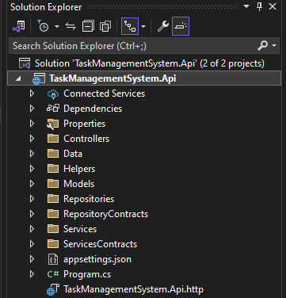
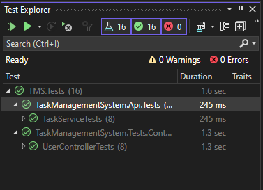

# Task Management System

This project consists of two parts:
1. **ASP.NET API** - Backend service
2. **Angular Frontend** - Frontend UI

Follow the instructions below to set up, run, and test the application.

---

## Prerequisites

- **ASP.NET Core 8.0** (or compatible version)
- **Node.js** (for Angular)
- **Angular CLI** (for Angular project)
- **SQL Server** (we're using an in-memory database in this project)
- **Swagger UI** (for API testing)
- **Visual Studio** (for opening and running the ASP.NET backend)

---

## Part 1: ASP.NET API Setup (In-Memory Database)

### 1. Clone the repository

```
git clone https://github.com/KhaledMoheb/IdealSolutions-TaskManagementSystem.git
```

### 2. Open API Project in Visual Studio
- Open TaskManagementSystem.Api project using Visual Studio.
- Visual Studio will automatically restore the NuGet packages and build the project.

### 3. Run the API (HTTP)
- Ensure that the API is running on HTTP and not HTTPS:
- In Visual Studio, go to the Properties of the project.
- Press Ctrl + F5 or use the Run button in Visual Studio to start the API on HTTP.
- Your API should now be running at http://localhost:5270. You can test the API using Swagger UI at http://localhost:5270/swagger.

## Part 2: Angular Frontend Setup
### 1. Navigate to the Angular Project
Go to the TaskManagementSystem directory:

```
cd ../TaskManagementSystem
```
### 2. Install Dependencies
Install all the necessary dependencies using npm:

```
npm install
```
### 3. Configure API URL
Make sure that the Angular frontend can connect to your ASP.NET API. Open src/environments/environment.ts and update the API base URL:

typescript
```
export const environment = {
  production: false,
  apiUrl: 'http://localhost:5270/api'  // Update with your API URL
};
```
### 4. Run the Angular Application
Start the Angular application:

```
ng serve --open
```
The Angular app will be running at http://localhost:4200.


## Part 3: Testing the Application
### 1. Test User Accounts
You can use the following test user accounts to log into the system:

Admin
Username: admin
Password: Admin123!
Role: Admin (can access all create/update/delete users and tasks)
User1
Username: user1
Password: User123!
Role: User (limited access, can only update own assigned tasks)

### 2. Log into the Application
For Admin: Use the admin credentials to log in and test all the features (view, create, update, delete users and their tasks).
For User1: Use user1 credentials to log in and test the restricted access (you should only be able to access user-dashboard).

API Endpoints (Swagger)
You can test the API using Swagger UI at http://localhost:5270/swagger. Here are the main endpoints:

- Login: POST /api/login/login - Logs in a user and returns a JWT token.
- Create Task: POST /api/task - Create a task (Admin only).
- Get All Tasks: GET /api/task - Get all tasks (Admin only).
- Get Task by ID: GET /api/task/{id} - Get task details by ID.
- Update Task: PUT /api/task/{id} - Update task details.
- Delete Task: DELETE /api/task/{id} - Delete a task (Admin only).

## Part 4: Running and Testing the ASP.NET Backend in Visual Studio

### 1. Open the API and Test Projects in Visual Studio
Open TaskManagementSystem.Api and TaskManagementSystem.Api.Tests solutions in Visual Studio.
Ensure that the necessary packages are restored.

### 2. Run the API Tests
In Visual Studio, go to the Test Explorer.
Run all tests or select specific tests related to the TaskService (like CreateTaskAsync_ShouldReturnSuccess_WhenUserIsFound or CreateTaskAsync_ShouldReturnError_WhenUserNotFound).
Check the results in the Test Explorer for any errors or failures.

## Screenshots

- ASP .NET Project Overview



- ASP .NET Tests Overview
